

# Racerweek

### A free night race through Kuala Lumpur, right in your browser

**[▶ Play now at racerweek.com](https://racerweek.com/)**

No download, no sign-up, no ads. One tap and you're on the road.

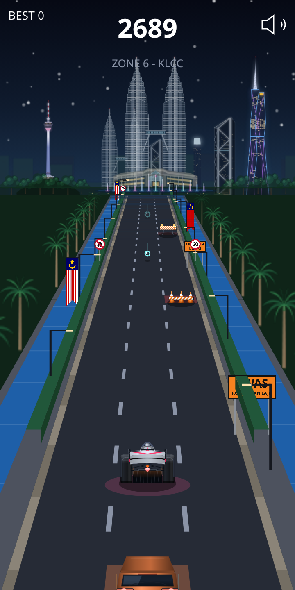&nbsp;
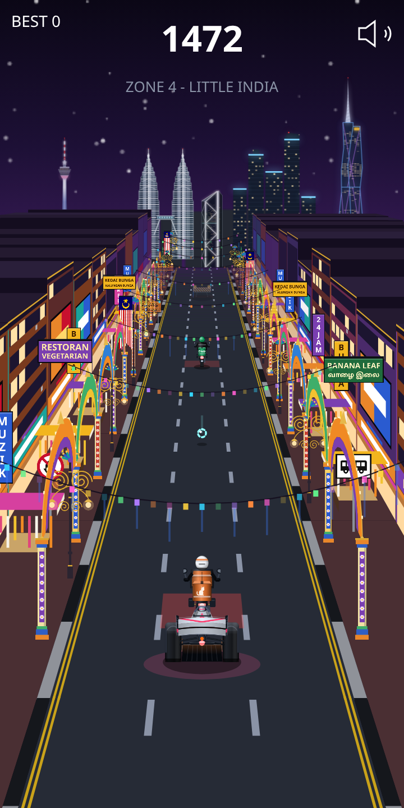&nbsp;
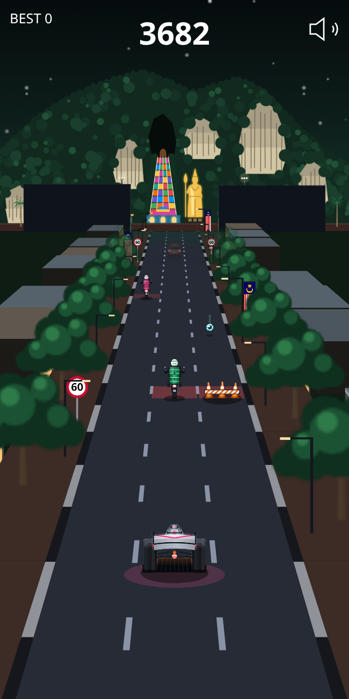

---

Inspired by F1 in Malaysia, and by the week every year when Sepang had KL talking about nothing but racing.

You drive a small open-wheel race car down a three-lane city street at night. Kapcai bikes, hatchbacks, barriers and cone rows fill the lanes, and you swerve between them. The further you go, the faster it gets, and the city changes around you: from the neon of Bukit Bintang, through Chinatown, Little India and Merdeka Square, past the Twin Towers, all the way to the golden statue at Batu Caves.

## How to play

| | Phone | Computer |
|---|---|---|
| Change lane | Tap the left or right side | <kbd>←</kbd> <kbd>→</kbd> or <kbd>A</kbd> <kbd>D</kbd> |
| Retry | Tap | <kbd>Space</kbd> or <kbd>Enter</kbd> |

One hit ends the run. Grab the glowing rings and squeeze past traffic for bonus points. Your best score is saved on your device.

## The landmarks

Every building in the game is drawn in code, line by line, from street photos of the real thing. There are no image files. On the left is how each landmark looks in the game; on the right is the real place.

<table>
<tr><td colspan="2" align="center"><b>KLCC Twin Towers</b> · KLCC · the world's tallest twin towers, with the skybridge and the park-side mall</td></tr>
<tr>
<td align="center" width="50%">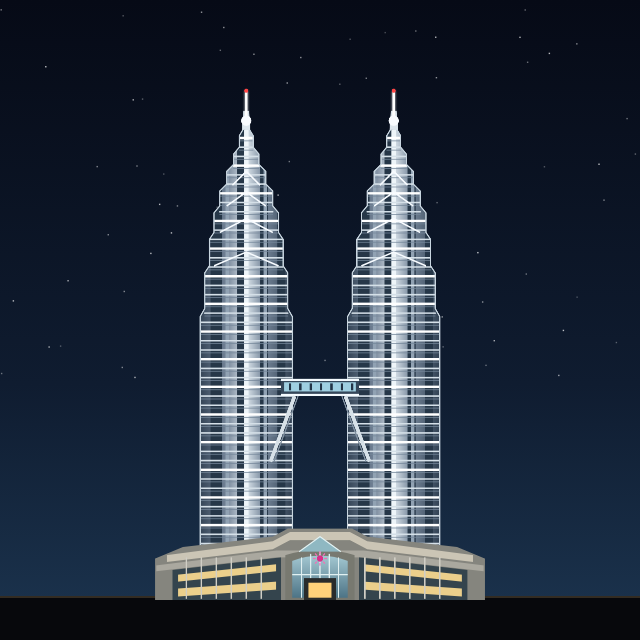 In the game</td>
<td align="center" width="50%">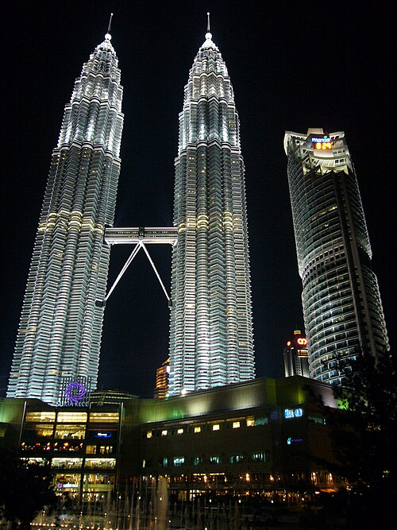 Photo: <a href="https://commons.wikimedia.org/wiki/File:Petronas_Twin_Towers_at_night_in_KL.JPG">Jordiferrer</a>, <a href="https://creativecommons.org/licenses/by-sa/3.0">CC BY-SA 3.0</a></td>
</tr>
<tr><td colspan="2" align="center"><b>Menara Kuala Lumpur</b> · On the skyline all the way · KL Tower on Bukit Nanas</td></tr>
<tr>
<td align="center" width="50%">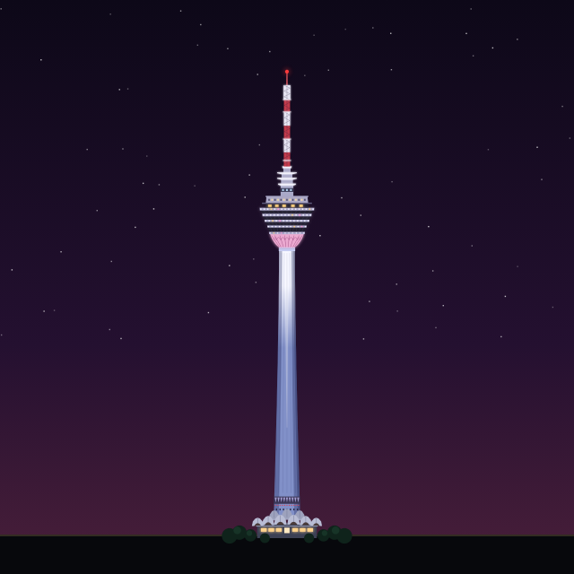 In the game</td>
<td align="center" width="50%">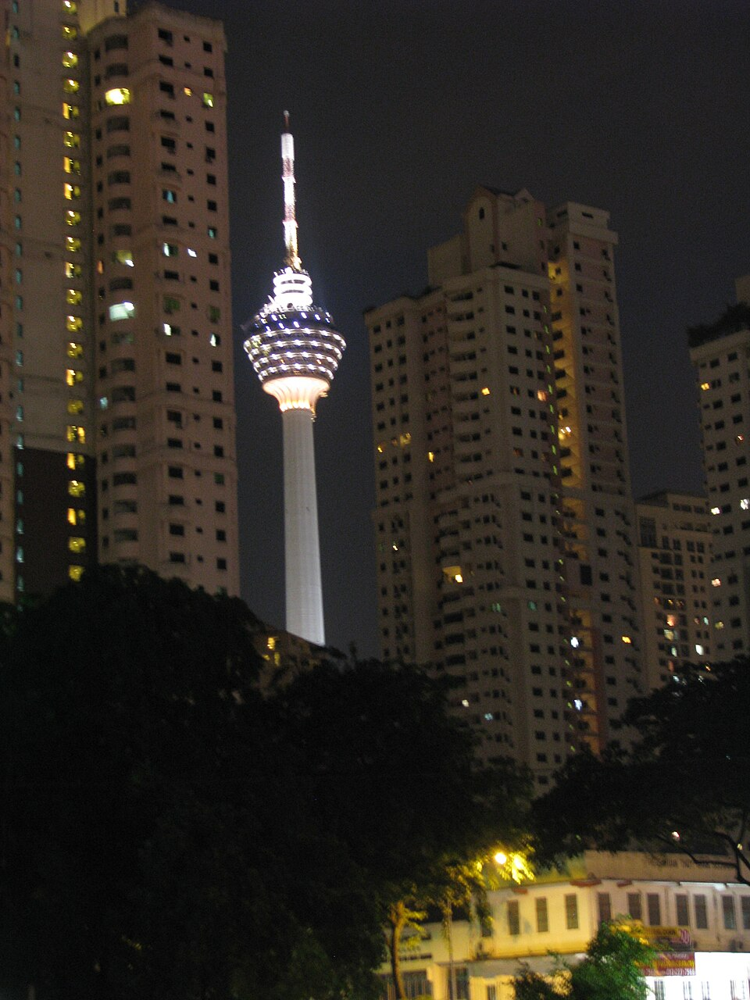 Photo: <a href="https://commons.wikimedia.org/wiki/File:Malaysia_-_066_-_KL_-_KL_Tower_(3528921394).jpg">McKay Savage from London, UK</a>, <a href="https://creativecommons.org/licenses/by/2.0">CC BY 2.0</a></td>
</tr>
<tr><td colspan="2" align="center"><b>Merdeka 118</b> · On the skyline · the second-tallest building in the world</td></tr>
<tr>
<td align="center" width="50%">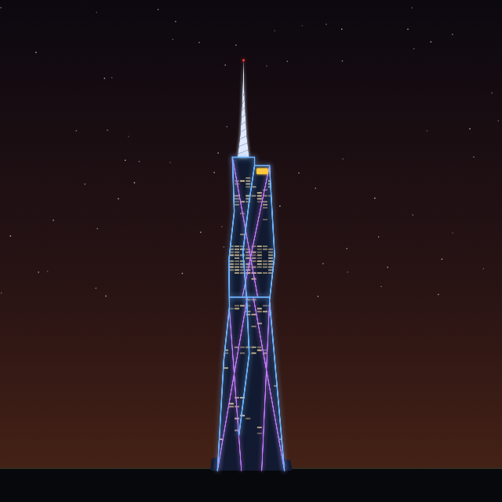 In the game</td>
<td align="center" width="50%">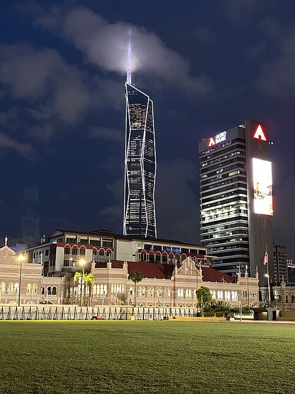 Photo: <a href="https://commons.wikimedia.org/wiki/File:Merdeka_118_at_night_(November_2025).jpg">Tyroleanguy</a>, <a href="https://creativecommons.org/licenses/by/4.0">CC BY 4.0</a></td>
</tr>
<tr><td colspan="2" align="center"><b>Exchange 106</b> · On the skyline · the glowing crown of TRX</td></tr>
<tr>
<td align="center" width="50%">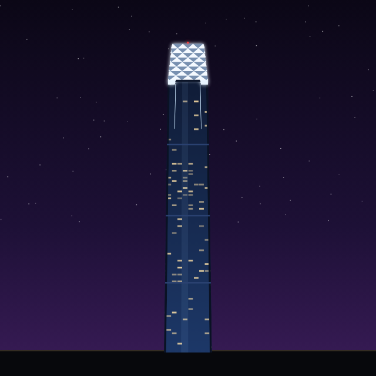 In the game</td>
<td align="center" width="50%">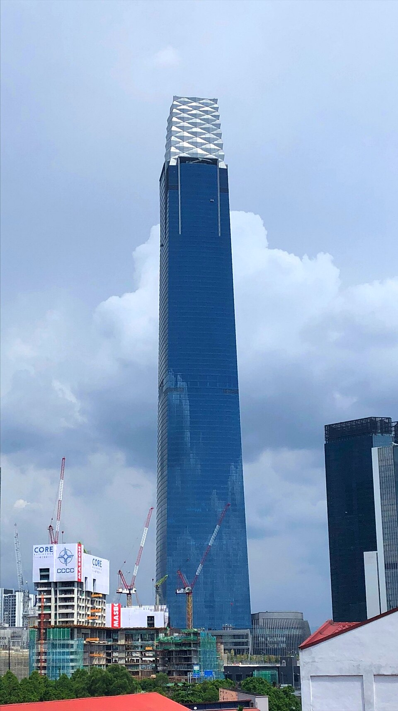 Photo: <a href="https://commons.wikimedia.org/wiki/File:The_Exchange_106_skyline_Nov_of_2021.jpg">LegendaryLim</a>, <a href="https://creativecommons.org/licenses/by-sa/4.0">CC BY-SA 4.0</a></td>
</tr>
<tr><td colspan="2" align="center"><b>Sultan Abdul Samad Building</b> · Dataran Merdeka · copper domes and the clock tower, floodlit</td></tr>
<tr>
<td align="center" width="50%">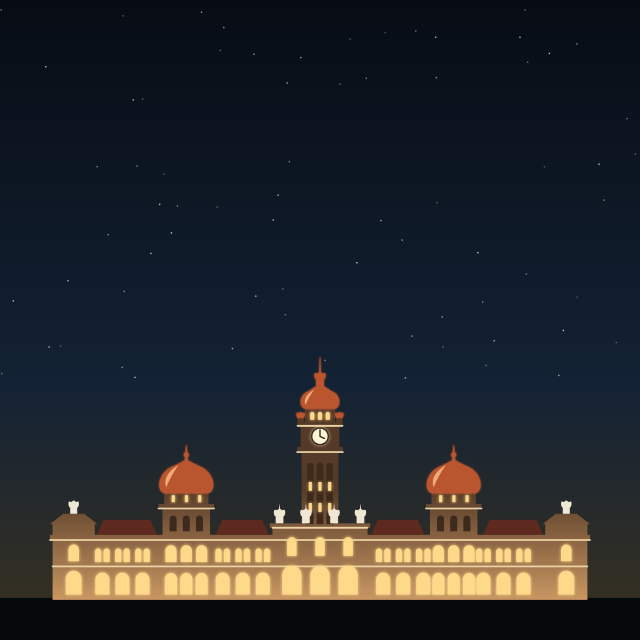 In the game</td>
<td align="center" width="50%">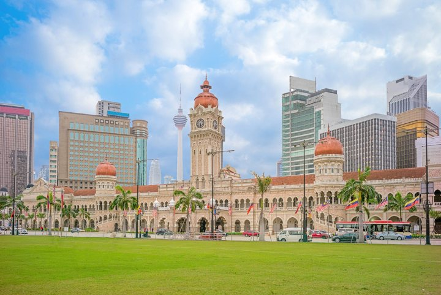</td>
</tr>
<tr><td colspan="2" align="center"><b>Central Market</b> · Pasar Seni · the pale-blue art deco market hall</td></tr>
<tr>
<td align="center" width="50%">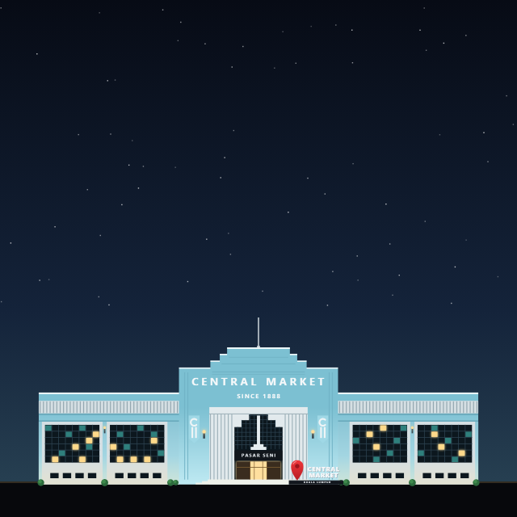 In the game</td>
<td align="center" width="50%">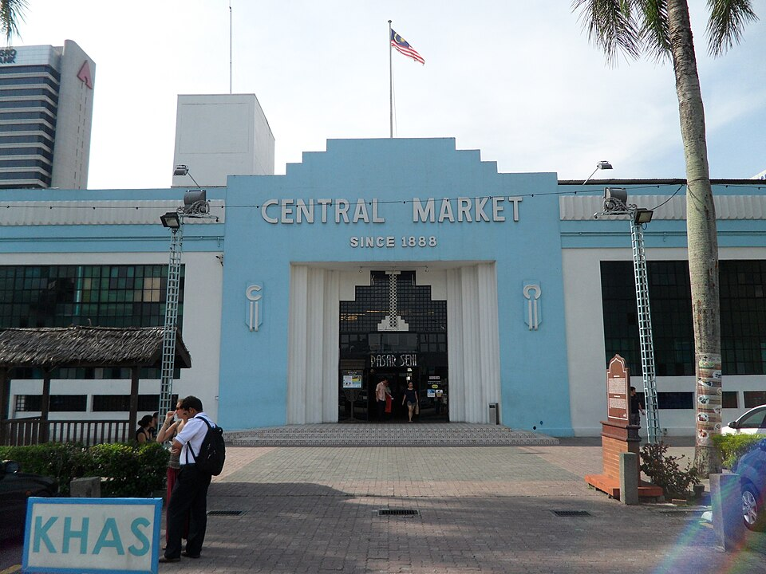 Photo: <a href="https://commons.wikimedia.org/wiki/File:Central_Market_6_June_2014.JPG">Bearsmalaysia</a>, <a href="https://creativecommons.org/licenses/by-sa/3.0">CC BY-SA 3.0</a></td>
</tr>
<tr><td colspan="2" align="center"><b>Jalan Petaling Gate</b> · Chinatown · gold-tiled roofs, stone lions and red lanterns, you drive right under it</td></tr>
<tr>
<td align="center" width="50%">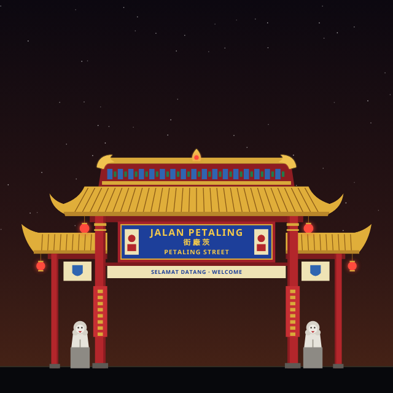 In the game</td>
<td align="center" width="50%">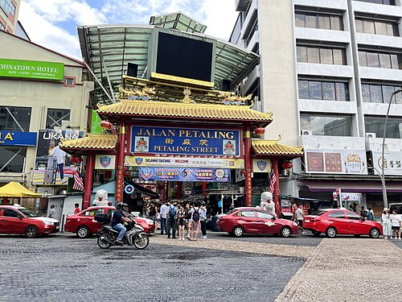 Photo: <a href="https://commons.wikimedia.org/wiki/File:Jalan_Petaling_2024.jpg">ほっきー</a>, <a href="http://creativecommons.org/publicdomain/zero/1.0/deed.en">CC0</a></td>
</tr>
<tr><td colspan="2" align="center"><b>Kasturi Walk Gate</b> · Pasar Seni · the giant wau (Malay kite) over the road</td></tr>
<tr>
<td align="center" width="50%">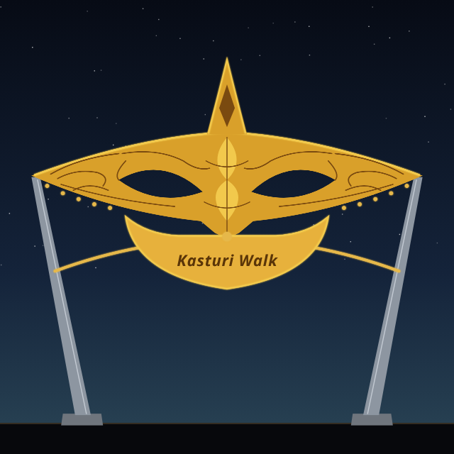 In the game</td>
<td align="center" width="50%">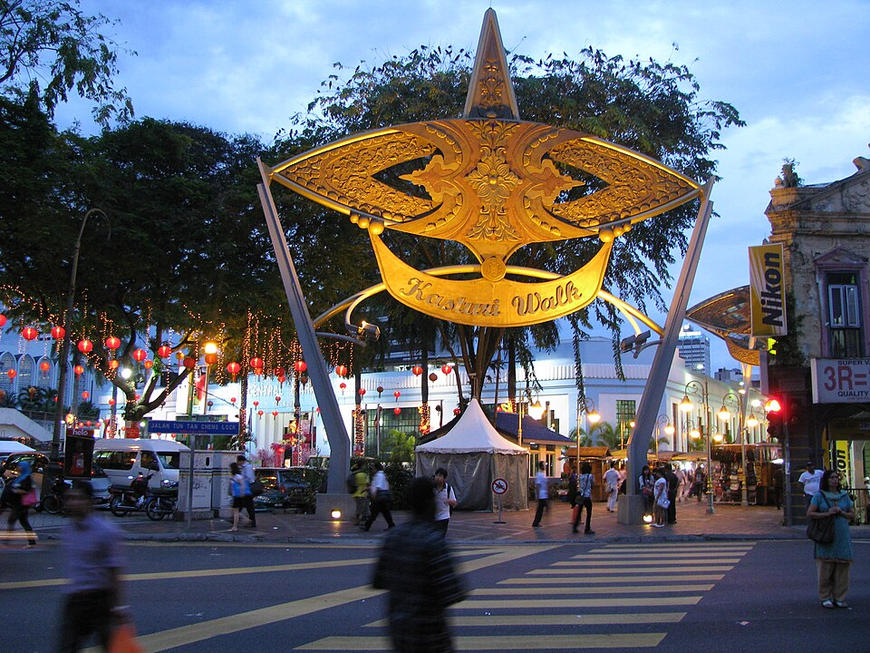 Photo: <a href="https://commons.wikimedia.org/wiki/File:Kasturi_Walk,_KL_(7904758618).jpg">shankar s. from Dubai, united arab emirates</a>, <a href="https://creativecommons.org/licenses/by/2.0">CC BY 2.0</a></td>
</tr>
<tr><td colspan="2" align="center"><b>Little India Gate</b> · Brickfields · peacock crests, welcome in Malay and Tamil</td></tr>
<tr>
<td align="center" width="50%">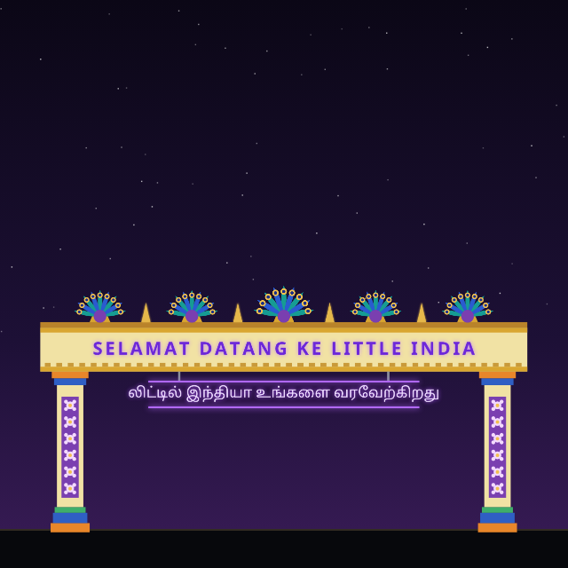 In the game</td>
<td align="center" width="50%">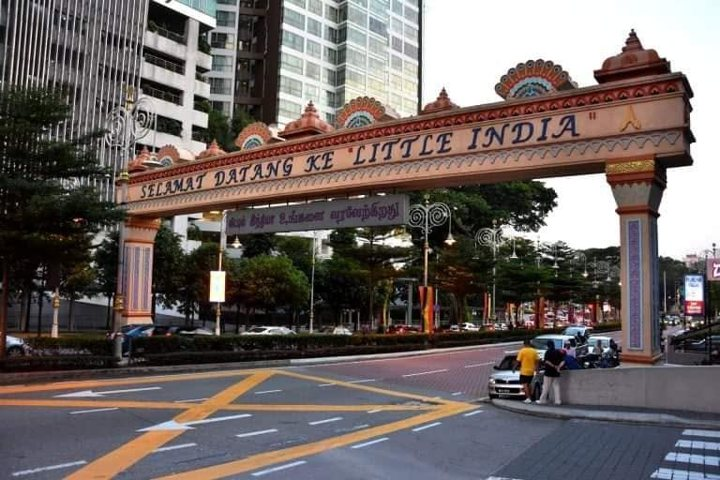</td>
</tr>
<tr><td colspan="2" align="center"><b>Ilham Tower</b> · The quiet stretch before KLCC · the steel diagonal grid</td></tr>
<tr>
<td align="center" width="50%">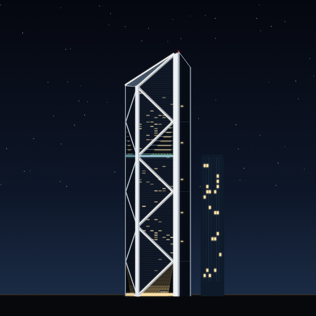 In the game</td>
<td align="center" width="50%">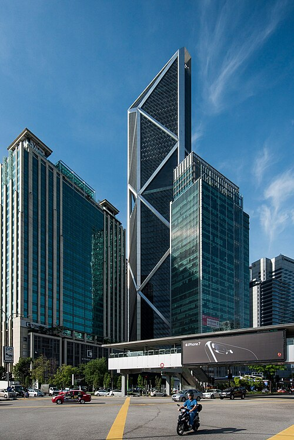 Photo: <a href="https://commons.wikimedia.org/wiki/File:Ilham_tower.jpg">rucksalziga</a>, <a href="https://creativecommons.org/licenses/by-sa/4.0">CC BY-SA 4.0</a></td>
</tr>
<tr><td colspan="2" align="center"><b>Great Eastern Mall</b> · Jalan Ampang · the rounded glass drum</td></tr>
<tr>
<td align="center" width="50%">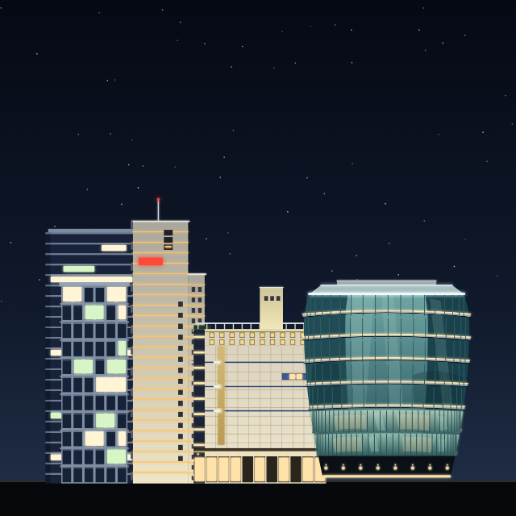 In the game</td>
<td align="center" width="50%">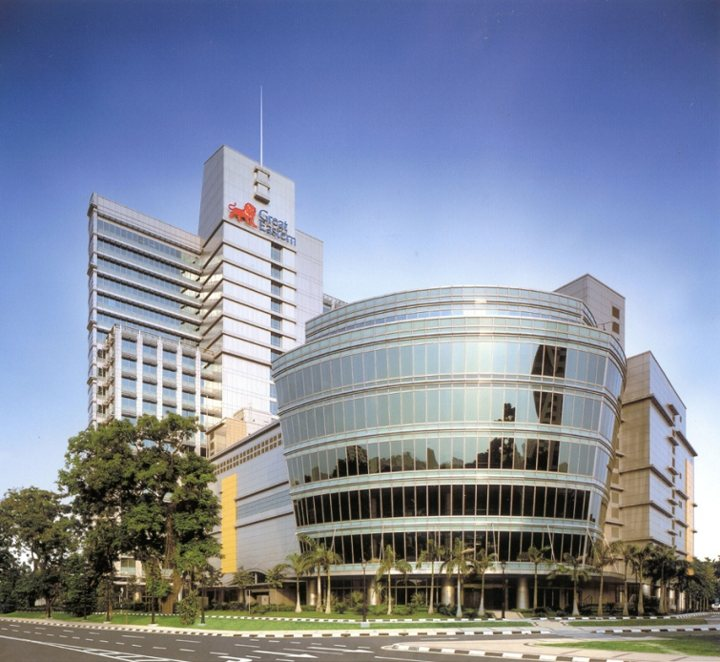</td>
</tr>
<tr><td colspan="2" align="center"><b>Batu Caves</b> · The finish · limestone hill, rainbow stairs and Lord Murugan's golden statue</td></tr>
<tr>
<td align="center" width="50%">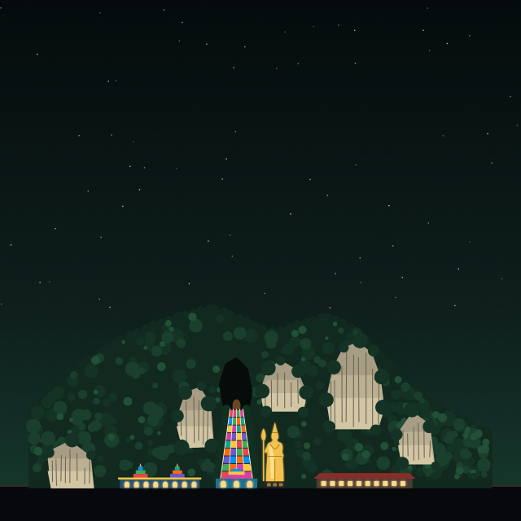 In the game</td>
<td align="center" width="50%">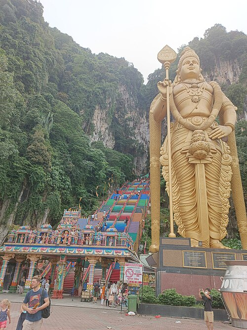 Photo: <a href="https://commons.wikimedia.org/wiki/File:Murugan_statue,_Batu_Caves_(220714)_02.jpg">*angys*</a>, <a href="https://creativecommons.org/licenses/by-sa/4.0">CC BY-SA 4.0</a></td>
</tr>
<tr><td colspan="2" align="center"><b>KL Monorail</b> · Bukit Bintang · the train glides over the street as you pass the station</td></tr>
<tr>
<td align="center" width="50%">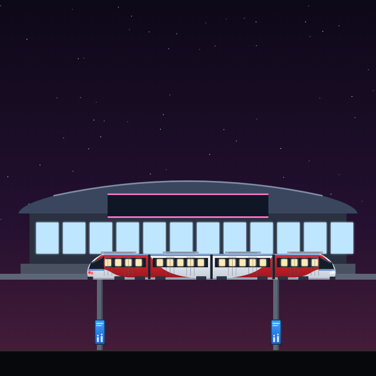 In the game</td>
<td align="center" width="50%">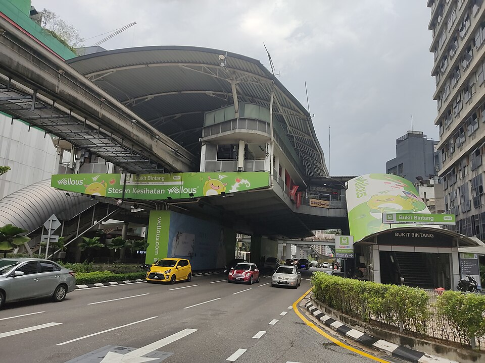 Photo: <a href="https://commons.wikimedia.org/wiki/File:Bukit_Bintang_Monorail_Station_outview_(211030).jpg">*angys*</a>, <a href="https://creativecommons.org/licenses/by-sa/4.0">CC BY-SA 4.0</a></td>
</tr>
<tr><td colspan="2" align="center"><b>Brickfields Skyline</b> · Little India · the glass towers around KL Sentral</td></tr>
<tr>
<td align="center" width="50%">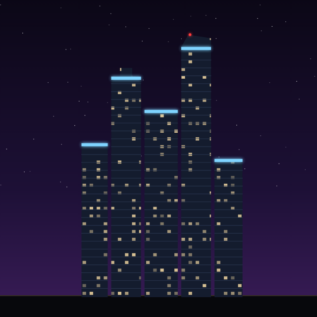 In the game</td>
<td align="center" width="50%"><i>Not a single real building: a stylised cluster inspired by the towers around KL Sentral</i></td>
</tr>
</table>

## The route

Every district has its own street: its own shopfronts, lamps, trees, pavement and signs. A gate or banner welcomes you into each district.

<table>
<tr>
<td align="center" width="33%">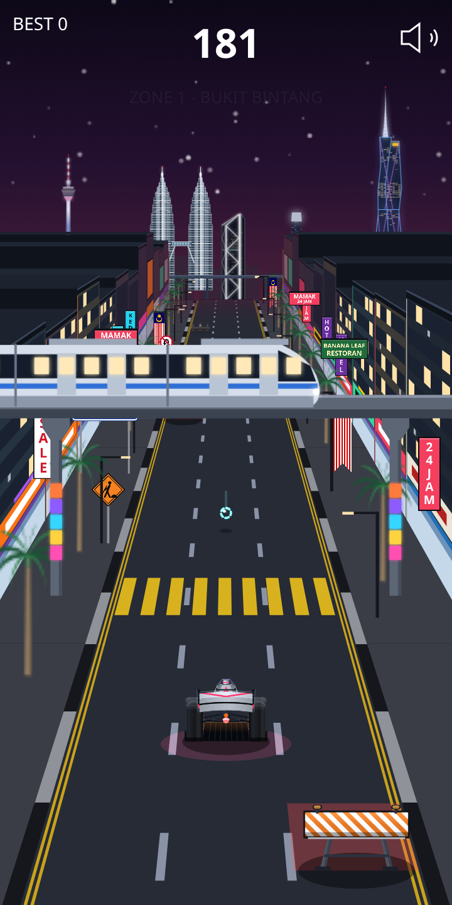 <b>1 · Bukit Bintang</b> Neon, shop boards and the monorail overhead</td>
<td align="center" width="33%">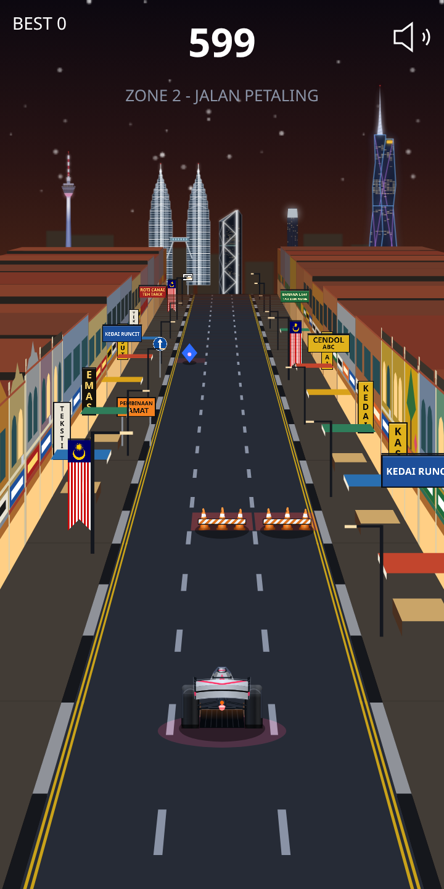 <b>2 · Jalan Petaling</b> Old shophouses and market stalls</td>
<td align="center" width="33%">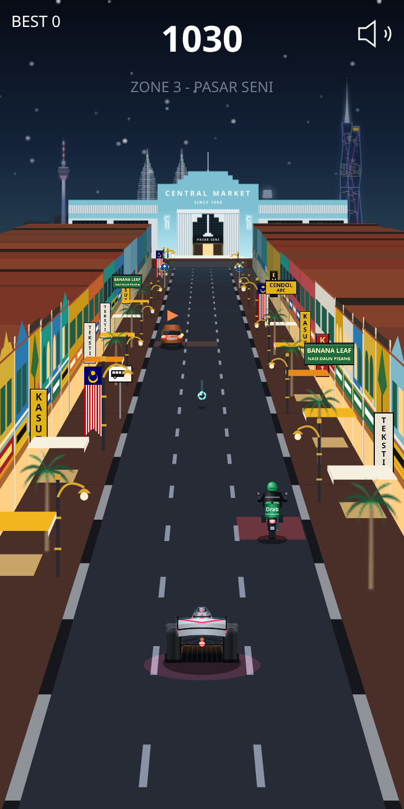 <b>3 · Pasar Seni</b> Central Market at the end of the street</td>
</tr>
<tr>
<td align="center"> <b>4 · Little India</b> Arches, garlands, spiral lamps and flower stalls</td>
<td align="center">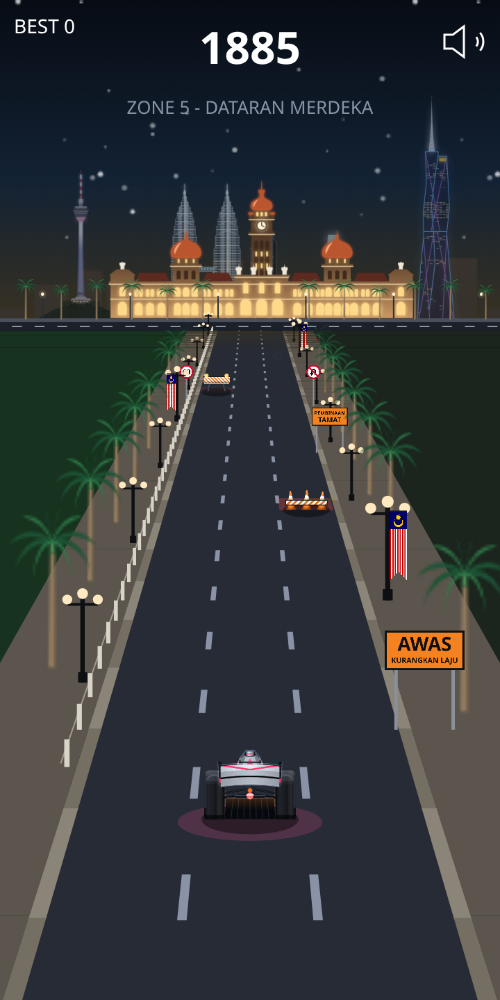 <b>5 · Dataran Merdeka</b> Royal palms and the heritage lamps of the square</td>
<td align="center">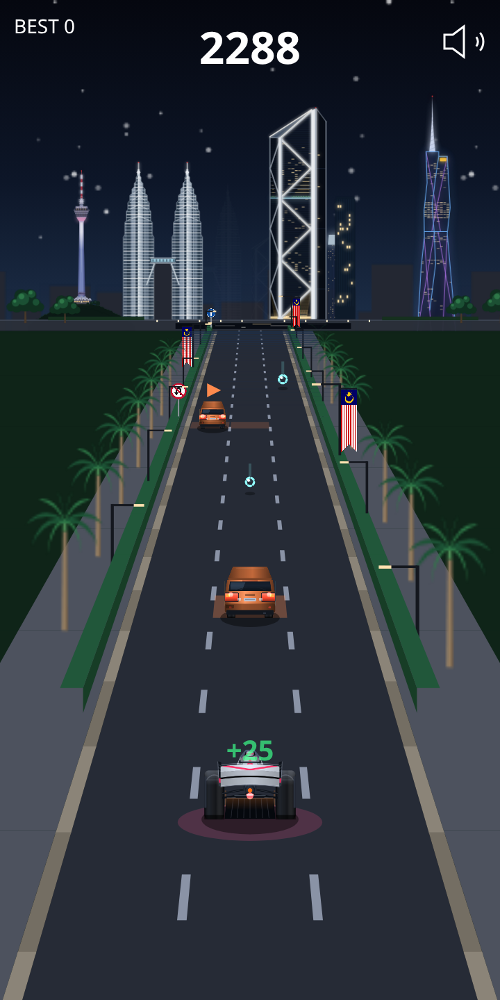 <b>Towards KLCC</b> Ilham Tower rising on the left</td>
</tr>
<tr>
<td align="center"> <b>6 · KLCC</b> The Twin Towers straight ahead</td>
<td align="center">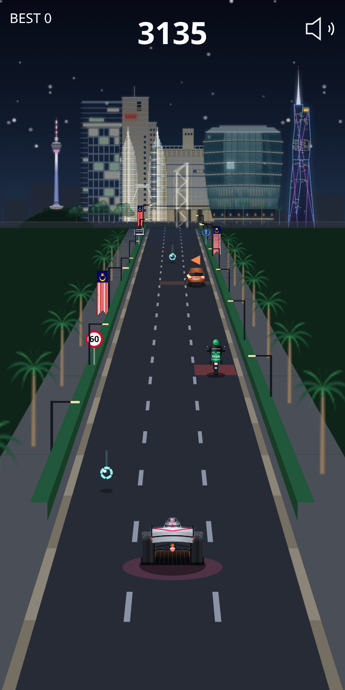 <b>Jalan Ampang</b> Past Great Eastern Mall</td>
<td align="center"> <b>7 · Batu Caves</b> The last stretch, under the golden statue</td>
</tr>
</table>

## On the road

<table>
<tr>
<td align="center" width="25%">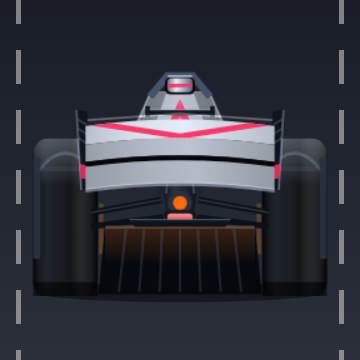 <b>You</b> A small open-wheel race car</td>
<td align="center" width="25%">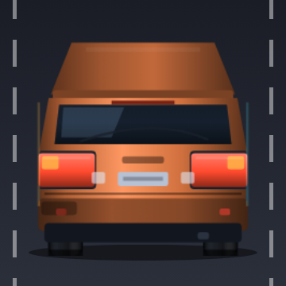 <b>Hatchback</b> Taking its time in your lane</td>
<td align="center" width="25%">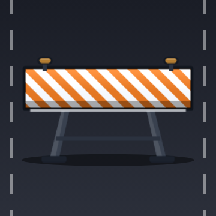 <b>Barrier</b> Roadworks, of course</td>
<td align="center" width="25%">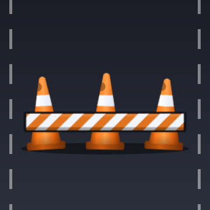 <b>Cone row</b> Lane closed</td>
</tr>
</table>

**Kapcai.** KL wouldn't be KL without the little step-through bikes. They come in five versions: plain, with a delivery box, and the green, pink and orange delivery riders (look for the cats on the boxes).

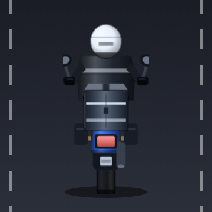
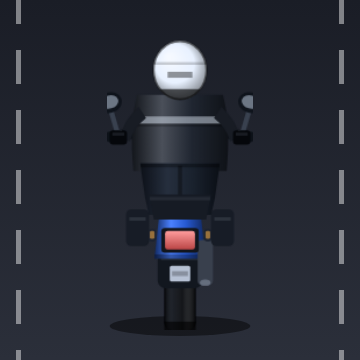
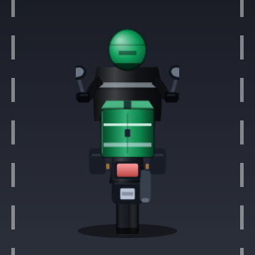
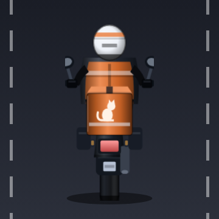
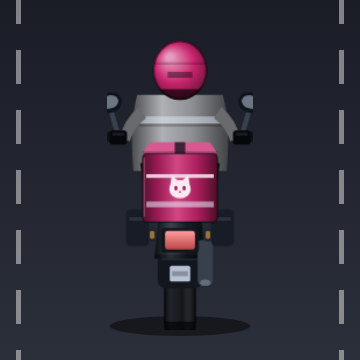

## Street details

**Shop boards.** Kopitiam, mamak, banana leaf, cendol, flower garlands and gold. The kopitiam in Chinatown carries its name in Chinese, and the banana-leaf restaurant in Little India in Tamil.

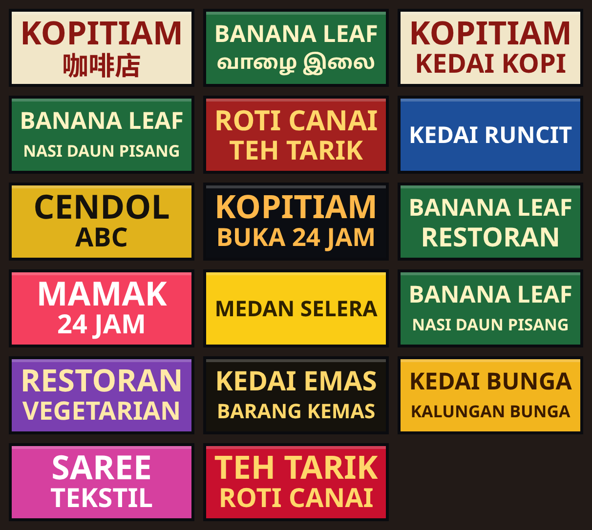

**Road signs.** Malaysian-style speed limits, bus stops and orange roadworks signs in Malay. Watch for the exit to Sepang early in the run.

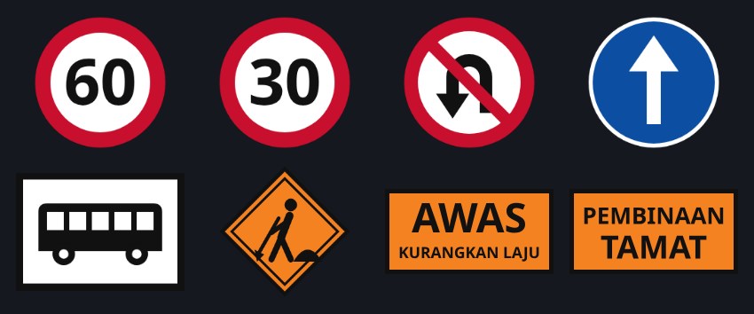
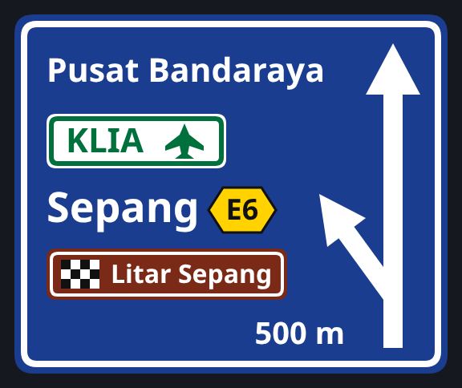

**Jalur Gemilang banners, blade signs and lamps.** The flag banners line the route, and the shophouse blade signs, arcade pillars and spiral lamps change from district to district.

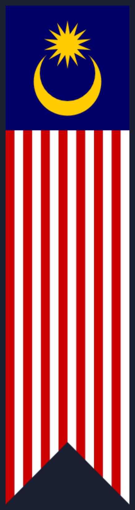&nbsp;&nbsp;
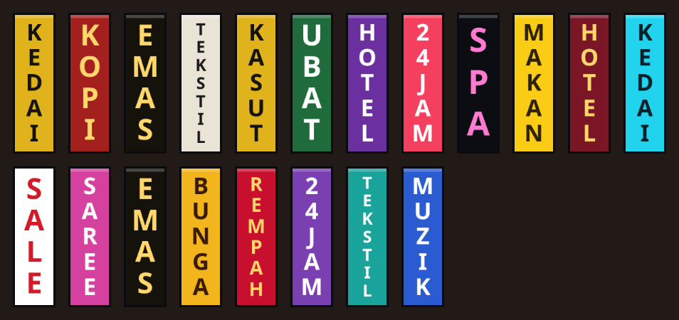&nbsp;&nbsp;
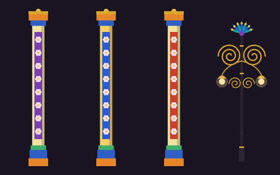

## Small, fast, and free

- Runs on phones and computers, in any modern browser.
- The whole game is a single web page, drawn in real time.
- No account, no tracking cookies, no pop-ups.

**[▶ Play Racerweek](https://racerweek.com/)**

---

Real-world photos belong to their authors. Photos from Wikimedia Commons are credited beneath each one with their licence. The game art is original.
